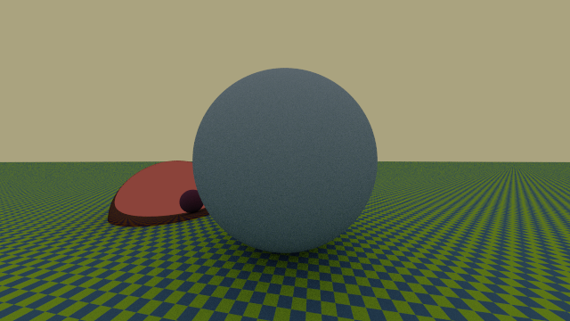

# Ray-Tracing

[](https://github.com/federicopellegatta/raytracing/actions)
[](https://www.gnu.org/licenses/gpl-3.0.html)

Ray-Tracing is a C++ code that you can use to generate photorealistic images.

## Installation
### Dependencies
   - C++ Compiler (at least C++17)
   - [CMake](https://cmake.org/) (at least version 3.16)
   - [GD library](https://libgd.github.io/) (at least version 2.5.5)
   - [pkg-config](https://www.freedesktop.org/wiki/Software/pkg-config/) (at least version 0.29)

If you want to generate animation, we recommend also:
   - [ffmpeg](https://www.ffmpeg.org/) (at least version 4.2.4)
   - [GNU parallel](https://www.gnu.org/software/parallel/) 

If you're willing to use [`conda`](https://docs.conda.io/en/latest/), or if you already do, all the above dependencies can be installed via
```
$ conda env create -n <envname> -f requirements.yml
```
Or you can your distribution package manager to install them.
  
### Download and building
If all the dependencies have been met, follow the instructions below in order to clone and compile Ray-Tracing in your own directory.
```
$ git clone https://github.com/federicopellegatta/raytracing.git
$ cd raytracing 
$ (if you're using conda -> conda activate <envname>)
$ cmake -S . -B build -DCMAKE_BUILD_TYPE=Release 
$ cd build/
$ cmake --build . -j <NUM_OF_CORES> # We advise at least 2 cores, as the compilation process is a bit slow
```
You will find tests and executable files in `build` directory. 

## Usage
To check if tests are passing do (inside `raytracing` directory)
```
$ cmake -S . -B build -DCMAKE_BUILD_TYPE=Debug 
$ cd build
$ cmake --build . -j <NUM_OF_CORES>
$ ctest
```
If tests are not passing feel free to open an issue.

A help menu will be displayed by typing (the command-line interface is built using [Taywee/args](https://github.com/Taywee/args))
```
$ ./raytracer --help
```
### Render
Ray-Tracing can generate images using 3 algorithms.
Inside the `example` directory there are input files defining different scenes. 

>Note that the file `example/demo.txt` contains instruction on how to write a correct input file.

The following command
```
./raytracer render -w 640 -h 360 --alg pathtracing --num-of-rays 5 --max-depth 4 --samples-per-pixel 25 --outf demo-5 -i ../examples/demo.txt
```
generate the following image (which is defined in the input file `example/demo.txt`)



Thanks to `ffmpeg` and a couple of cli options it is possibile to generate simple animations; for instance the command
```
$ ./demo_animation -j <NUM_OF_CORES>
```
will produce


### Convert images from HDR to LDR format
Ray-Tracing can also convert images from HDR to LDR format (only `png` and `jpeg` are supported):  use the `convertpfm2png` command as in the following example:
```
$ ./raytracer convertpfm2png --inpfm=/path/to/pfm-file --outpng=/path/to/output-file -f 1.0 -g 1.0
```

## Contributing
If you wish to contribute or you have just found any bug, please open an issue or a pull request on our GitHub repository. Thank you!

## Licence
Ray-Tracing is licensed under the terms of the [GNU General Public License v3.0](https://www.gnu.org/licenses/gpl-3.0.html) and is available for free. See the file [LICENCE.md](https://github.com/federicopellegatta/raytracing/blob/master/LICENCE.md).
